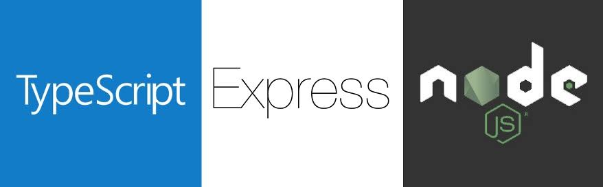
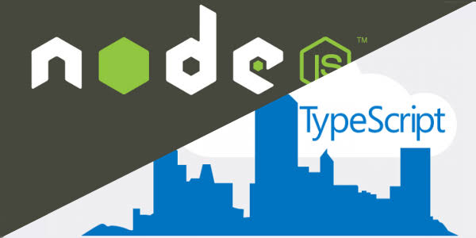
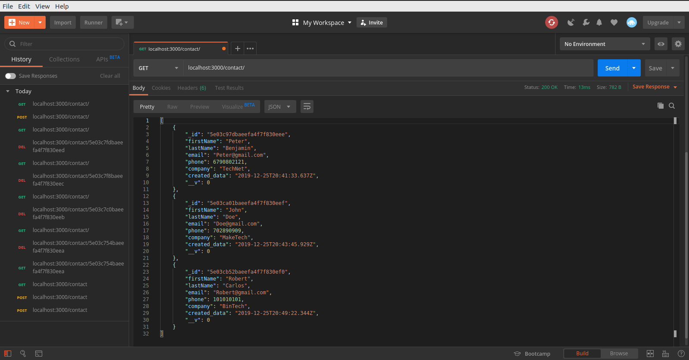

# Learn programming how to build RESTful Web APIs with Node.js, Express, MongoDB and TypeScript


## Getting Started

Node and typescript is for web programming languages by practicing step by step with tests and levels. Good for beginners and to test their capabilities in web programming.

## Features

* typescript
* nodejs
* RESTFull APi's
* MongoDB

### Installing and Run

* `git clone https://github.com/savalone47/node-api-typescritp.git`
* `cd node-api-typescritp`

* `$ npm install`
* `$ npm run build && npm run start`
* optional: include *.env* in your *.gitignore*




```javascript
import * as bodyParser from "body-parser";
import * as express from "express";
import * as mongoose from "mongoose";
import { Routes } from "./routes/crmRoutes";

class App {

	public app     : express.Application;
	public routePrv: Routes = new Routes();
	public mongoUrl: string = 'mongodb://localhost:27017/CRMdb';
	
	constructor(){
		this.app = express();
		this.config();
		this.routePrv.routes(this.app);
		this.mongoSetup();
	}
	private config():void {
		this.app.use(bodyParser.json());
		this.app.use(bodyParser.urlencoded(
			{extended: false}
		));
	}
	private mongoSetup():void {
		mongoose.Promise = global.Promise;
		mongoose.connect(
			this.mongoUrl,
			{ useUnifiedTopology: true }
		);
	}
}
export default new App().app;
```




#### Author

* **Savalone47** - *Initial work* - [node-api-typescript](https://github.com/savalone47/node-api-typescript)


#### License

This project is licensed under the MIT License - see the [LICENSE.md](LICENSE.md) file for details